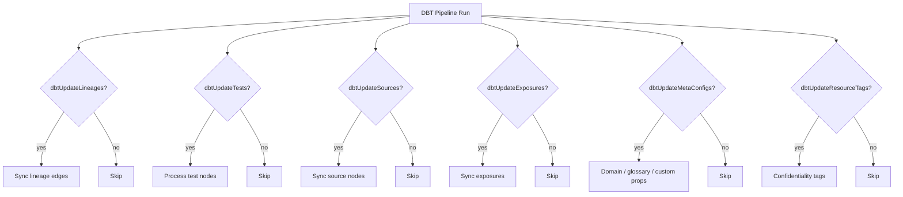
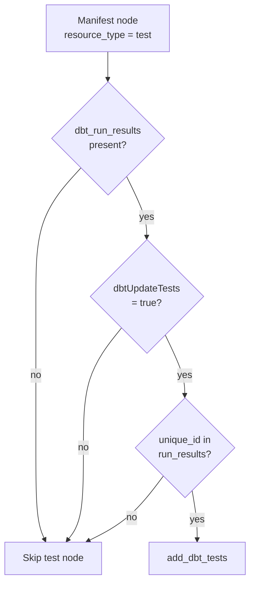
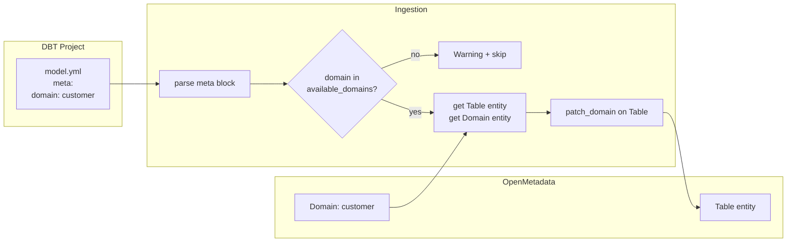
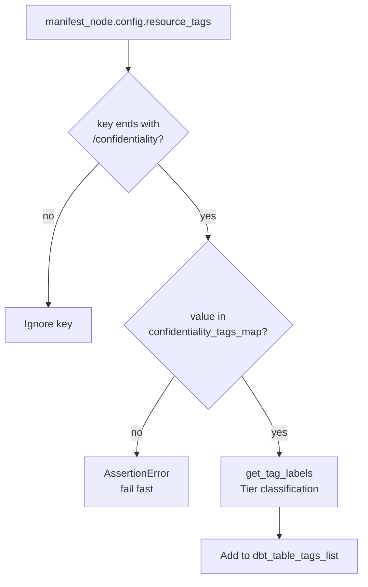
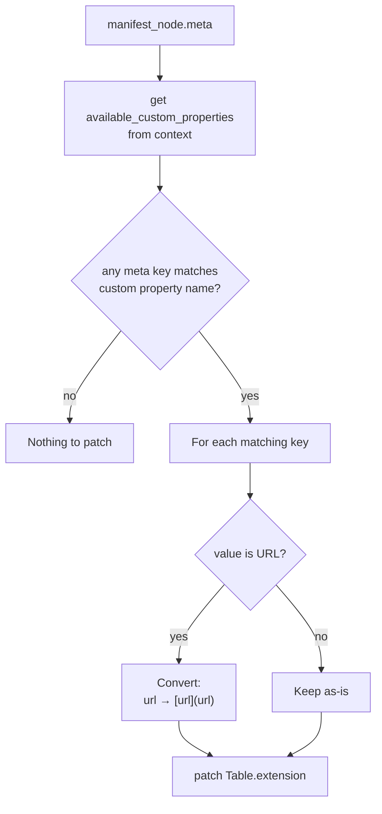
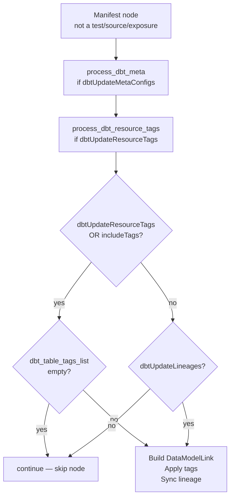
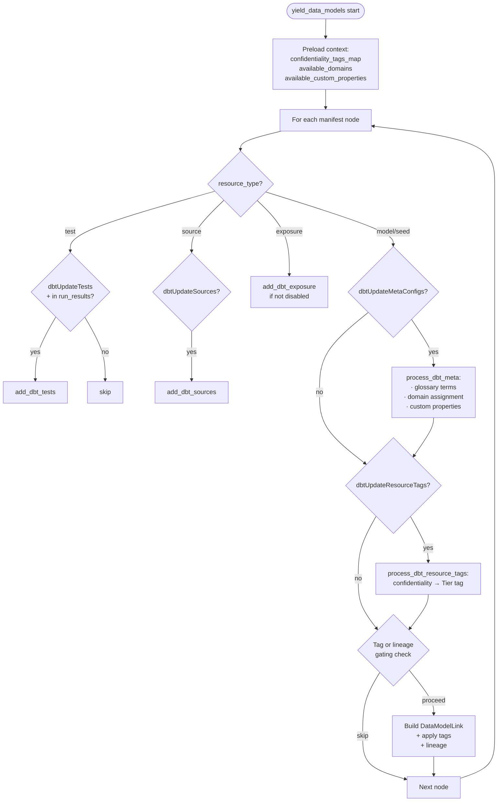

# DBT ingestion changes — onboarding guide

**Branch:** `release-1.9.15`
**Author:** Nithin Teekaramanaa
**Period:** November 2025 – January 2026
**Files changed:**
- `openmetadata-spec/src/main/resources/json/schema/metadataIngestion/dbtPipeline.json`
- `ingestion/src/metadata/ingestion/source/database/dbt/metadata.py`

---

## Abstract

OpenMetadata's `DbtSource` connector does everything in one pass — descriptions, lineage, tests, exposures, tags. That's fine for a demo, but not for a production lakehouse where different metadata dimensions have different refresh cadences and different owners. Running a full sync every time you just want to update confidentiality tags is wasteful and risky.

These changes tackle that in two ways. First, they introduce **granular feature flags** so each part of the DBT sync can be switched on or off independently. Second, they add **three enrichment capabilities** that the upstream connector does not have:

1. **Domain assignment** — reads a `domain` key from a DBT model's `meta` block and applies it to the corresponding OpenMetadata table.
2. **Confidentiality tagging** — reads `resource_tags` from a model's config block, picks up keys matching the `*/confidentiality` convention Kärcher already uses in their cloud infrastructure, and maps them to the `Tier` classification in OpenMetadata.
3. **Custom property sync** — takes any key in `meta` that matches a registered OpenMetadata custom property and patches it onto the table entity. URLs are automatically converted to markdown links so they render as clickable in the UI.

Everything is driven by the DBT manifest. No extra files, no separate pipelines.

---

## Commit timeline


---

## Layer 1 — Schema (feature flags)

### What changed

The `dbtPipeline.json` spec gained six new boolean properties, all defaulting to `false`. Existing pipelines are unaffected — nothing new runs unless you opt in.

| Flag | Purpose |
|---|---|
| `dbtUpdateLineages` | Control whether lineage edges from DBT are synced |
| `dbtUpdateTests` | Control whether DBT test nodes are processed |
| `dbtUpdateSources` | Control whether DBT source nodes are synced |
| `dbtUpdateExposures` | Control whether DBT exposure nodes are synced |
| `dbtUpdateMetaConfigs` | Control whether `meta` blocks (domain, glossary, custom props) are processed |
| `dbtUpdateResourceTags` | Control whether `config.resource_tags` (confidentiality) are mapped |

### Why

Before these flags, a lineage-only run would still touch tags, tests, and descriptions. Splitting them apart lets each Airflow DAG run do exactly the work it was scheduled for, and nothing else.



---

## Layer 2 — Initialisation (context preloading)

### What changed

At the start of `yield_data_models()`, three lookups run once and get stored in the pipeline context before the main node loop begins:

```python
self.context.get().confidentiality_tags_map = self.get_confidentiality_tags_map()
self.context.get().available_domains       = self.get_available_domains()
self.context.get().available_custom_properties = self.get_available_custom_properties()
```

| Context key | Populated by | Content |
|---|---|---|
| `confidentiality_tags_map` | `get_confidentiality_tags_map()` | `{ displayName → fullyQualifiedName }` for all tags under classification `"Tier"` |
| `available_domains` | `get_available_domains()` | List of `fullyQualifiedName` strings for every domain registered in OpenMetadata |
| `available_custom_properties` | `get_available_custom_properties()` | List of custom property definitions for `Table` entities |

### Why

A DBT manifest can have thousands of nodes. If domain validation or tag lookups made an API call per node, the ingestion run time would be unacceptable. These three datasets don't change during a run, so fetching them once upfront and reading from context on every iteration is the right call.

```mermaid
sequenceDiagram
    participant Loop as yield_data_models()
    participant OM as OpenMetadata API

    Note over Loop: Startup — fetch once
    Loop->>OM: list_entities(Tag, parent=Tier)
    OM-->>Loop: confidentiality_tags_map
    Loop->>OM: list_entities(Domain)
    OM-->>Loop: available_domains
    Loop->>OM: get_entity_custom_properties(Table)
    OM-->>Loop: available_custom_properties

    Note over Loop: Per-node loop (thousands of iterations)
    Loop->>Loop: process_dbt_resource_tags() — reads from context
    Loop->>Loop: process_dbt_meta() — reads from context
```

---

## Layer 3 — Test filtering

### What changed

Previously, any test node in the manifest would be processed whenever a `dbt_run_results` file was present. Now two conditions must both hold:

1. `dbtUpdateTests = true` (new flag)
2. The test's `unique_id` must appear in the run results — it actually ran

```python
def filter_test_based_on_run_results(self, dbt_objects: DbtObjects):
    unique_ids = set()
    for run_result in dbt_objects.dbt_run_results:
        for result in run_result.results:
            if result.unique_id:
                unique_ids.add(result.unique_id)
    return unique_ids
```

### Why

A DBT manifest lists every test that could theoretically run — including skipped, deferred, or package-level tests that never touched your data. Syncing all of them into OpenMetadata would pollute the test history with results that don't exist. Filtering by what's in `run_results` means OpenMetadata reflects what actually happened.



---

## Layer 4 — Domain assignment

### What changed

If a DBT model has a `domain` key in its `meta` block and `dbtUpdateMetaConfigs = true`, the ingestion validates the domain name against the live OpenMetadata domain list and patches it onto the table entity.

**DBT model YAML example:**
```yaml
models:
  - name: customer_orders
    meta:
      domain: customer
```

**Processing flow in `process_dbt_meta()`:**
```python
if manifest_node.meta.get("domain"):
    allowed_domains = self.context.get().available_domains
    assert domain_value.lower() in allowed_domains
    table_entity = self.metadata.get_by_name(Table, fqn=f"datalake.{db}.{schema}.{name}")
    domain = self.metadata.get_by_name(Domain, fqn=domain_value.lower())
    self.metadata.patch_domain(entity=Table, source=table_entity, domains=..., force=True)
```

### Evolution of this feature

This went through two iterations:

- **Commit `6d21d55`** — First version: hardcoded list of five allowed domains (`["customer", "material", "finance", "supplier", "x-domain"]`), domain patching inline inside the node loop.
- **Commit `824fb2`** — Refactored: allowed domain list fetched live from OpenMetadata API (hardcoded list removed), domain logic moved inside `process_dbt_meta()`.

### Why

Without this, a data engineer wanting to assign a domain would have to do it manually in the OpenMetadata UI for every table. That doesn't scale and it puts the metadata in a different place from the model definition. Declaring `domain: customer` in the dbt YAML keeps the domain ownership in version control next to the model, and the ingestion job handles the rest.

The first version hardcoded the allowed domain list, which would have gone stale as the governance taxonomy changed. The refactor pulls the list from the API so it's always in sync.



---

## Layer 5 — Confidentiality tagging

### What changed

A new method `process_dbt_resource_tags()` reads the `resource_tags` section from a DBT model's config block and maps keys ending with `/confidentiality` to OpenMetadata `Tier` tags.

**DBT model config example:**
```yaml
models:
  - name: customer_orders
    config:
      resource_tags:
        kärcher.com/confidentiality: Confidential
```

**Processing:**
```python
def process_dbt_resource_tags(self, manifest_node):
    for key, value in manifest_node.config.model_dump().get('resource_tags').items():
        if key.endswith('/confidentiality'):
            assert value in self.context.get().confidentiality_tags_map.keys()
            logger.info(f"Processed DBT resource tags for: {manifest_node.name}")
            return get_tag_labels(
                metadata=self.metadata,
                tags=[confidentiality_tags_map[value].split(FQN_SEPARATOR)[-1]],
                classification_name=confidentiality_tags_map[value].split(FQN_SEPARATOR)[0],
                include_tags=True,
            )
```

### Why

Kärcher already uses the `domain.com/key: value` label convention across their cloud infrastructure (Kubernetes resources, GCP labels, etc.). `resource_tags` with a `/confidentiality` suffix follows that same convention. Picking it up here means data engineers don't need to learn a new pattern — they label data assets the same way they label everything else. OpenMetadata's `Tier` classification is the natural home for sensitivity levels, so the ingestion bridges the two systems automatically.



---

## Layer 6 — Custom property sync

### What changed

`process_dbt_meta()` now checks whether any key in a model's `meta` block matches a registered OpenMetadata custom property on `Table`. Matching key-value pairs are patched onto the entity as custom properties.

One transformation is applied: if a value is a plain URL (starts with `http://` or `https://`), it gets converted to a markdown link `[url](url)` before writing. This makes it clickable in the UI.

**New method `process_dbt_custom_properties()`:**
```python
def process_dbt_custom_properties(self, matching_keys: dict, manifest_node):
    table_entity = self.metadata.get_by_name(Table, fqn=..., fields=["extension"])
    table_entity_copy = deepcopy(table_entity)
    processed_keys = {}
    for key, value in matching_keys.items():
        if isinstance(value, str) and value.startswith(('http://', 'https://')):
            processed_keys[key] = f"[{value}]({value})"
        else:
            processed_keys[key] = value
    table_entity_copy.extension = EntityExtension(processed_keys)
    self.metadata.patch(entity=Table, source=table_entity, destination=table_entity_copy)
```

### Why

Custom properties are how OpenMetadata handles governance metadata that doesn't fit the standard schema — compliance references, SLA links, documentation URLs, data product IDs. A separate sync tool for these would mean a second place to maintain config. Reading from `meta` keeps everything in the dbt project, which is already the source of truth for the model.



---

## Layer 7 — Node processing gate

### What changed

The main loop in `yield_data_models()` has a gating block that decides whether a manifest node needs further processing or can be skipped. The logic evolved across two commits into:

```python
if (self.source_config.dbtUpdateResourceTags or self.source_config.includeTags):
    if not dbt_table_tags_list:
        continue   # No tags to apply — skip this node entirely

elif not self.source_config.dbtUpdateLineages:
    continue       # Tags not enabled, lineage not enabled — nothing to do
```

### Why

When a pipeline run is configured only to sync tags, there's no point fetching the table entity, building data model links, or resolving lineage for nodes that have no tags. Skipping early keeps API calls proportional to actual work. A manifest with 2,000 models where only 200 have tags means 1,800 nodes exit here with no downstream cost.



---

## Full data flow

How all layers interact for a single DBT model node:



---

## Configuration reference

A complete connector configuration using all new flags:

```yaml
source:
  type: dbt
  serviceConnection:
    config:
      type: Dbt
  sourceConfig:
    config:
      type: DBT
      dbtConfigSource:
        dbtLocalConfigSource:
          dbtCatalogFilePath: /path/to/catalog.json
          dbtManifestFilePath: /path/to/manifest.json
          dbtRunResultsFilePath: /path/to/run_results.json
      # Granular feature flags — all default to false
      dbtUpdateLineages: true
      dbtUpdateTests: true
      dbtUpdateSources: false
      dbtUpdateExposures: false
      dbtUpdateMetaConfigs: true      # enables domain + custom properties
      dbtUpdateResourceTags: true     # enables confidentiality tagging
      includeTags: true
```

---

## Key design decisions

| Decision | Rationale |
|---|---|
| All new flags default to `false` | Existing pipelines are not broken by the changes. New capabilities opt-in only. |
| Context preloading for lookups | Avoids per-node API calls for static data (domains, tags, custom property names). |
| Domain list fetched live from API | Eliminates hardcoded lists that go stale as the governance taxonomy evolves. |
| `assert` for invalid domain/tag values | Fail fast with a clear message rather than silently skipping or writing bad data. |
| URL-to-markdown conversion | Custom property values that are URLs become clickable links in the OpenMetadata UI automatically. |
| `filter_test_based_on_run_results` | Ensures only tests that actually executed are tracked — not the full theoretical test suite. |

---

## Summary of new methods

| Method | File | Purpose |
|---|---|---|
| `get_confidentiality_tags_map()` | `metadata.py:234` | Fetch all Tier tags from OpenMetadata; return `{displayName → fqn}` |
| `get_available_domains()` | `metadata.py:244` | Fetch all registered domains; return list of fqn strings |
| `get_available_custom_properties()` | `metadata.py:253` | Fetch custom property definitions for Table entity type |
| `filter_test_based_on_run_results()` | `metadata.py:527` | Return set of unique_ids from run results files |
| `process_dbt_resource_tags()` | `metadata.py:1071` | Map `resource_tags[*/confidentiality]` to Tier tag labels |
| `process_dbt_custom_properties()` | `metadata.py:1094` | Patch matching meta keys as custom properties on Table |
| `process_dbt_meta()` | `metadata.py:1126` | Orchestrate: glossary terms + domain + custom properties from meta block |
